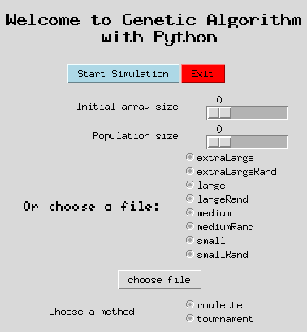

## How to run the genetic algorithm
### Option 1 - Interface:
*Requirements: python3 and tkinter*


```
$ python simulation.py
```

You can then choose between:
+ a file containing a dataset
+ a randomly generated dataset



### Option 2 - Terminal:
```
$ python algo.py
```

### Results:
<table>
    <tr>
        <th>Dataset</th>
        <th>Size</th>
        <th>Population size</th>
        <th>Solution length</th>
        <th>Time (1000 generations)</th>
        <th>Method</th>
    </tr>
    <tr>
        <td>smallRand</td>
        <td>30</td>
        <td>100</td>
        <td>20</td>
        <td>4.99s</td>
        <td>tournament</td>
    </tr>
    <tr>
        <td>smallRand</td>
        <td>30</td>
        <td>100</td>
        <td>21</td>
        <td>9.33s</td>
        <td>roulette</td>
    </tr>
    <tr>
        <td>small</td>
        <td>39</td>
        <td>200</td>
        <td>28</td>
        <td>11.44s</td>
        <td>tournament</td>
    </tr>
    <tr>
        <td>small</td>
        <td>39</td>
        <td>200</td>
        <td>27</td>
        <td>28.32s</td>
        <td>roulette</td>
    </tr>
    <tr>
        <td>mediumRand</td>
        <td>1000</td>
        <td>300</td>
        <td>502</td>
        <td>219.56s</td>
        <td>tournament</td>
    </tr>
    <tr>
        <td>mediumRand</td>
        <td>1000</td>
        <td>300</td>
        <td>489</td>
        <td>246.04s</td>
        <td>roulette</td>
    </tr>
    <tr>
        <td>medium</td>
        <td>1166</td>
        <td>400</td>
        <td>590</td>
        <td>327.70s</td>
        <td>tournament</td>
    </tr>
    <tr>
        <td>medium</td>
        <td>1166</td>
        <td>400</td>
        <td>589</td>
        <td>406.26s</td>
        <td>roulette</td>
    </tr>
    <tr>
        <td>largeRand</td>
        <td>10000</td>
        <td>100</td>
        <td>none</td>
        <td>660.92s</td>
        <td>tournament</td>
    </tr>
    <tr>
        <td>largeRand</td>
        <td>10000</td>
        <td>100</td>
        <td>none</td>
        <td>676.91s</td>
        <td>roulette</td>
    </tr>
    <tr>
        <td>large</td>
        <td>10485</td>
        <td>100</td>
        <td>none</td>
        <td>657.74s</td>
        <td>tournament</td>
    </tr>
    <tr>
        <td>large</td>
        <td>10485</td>
        <td>300</td>
        <td>none</td>
        <td>1940.93s</td>
        <td>roulette</td>
    </tr>
    <tr>
        <td>extraLargeRand</td>
        <td>50000</td>
        <td>-</td>
        <td>-</td>
        <td>-</td>
        <td>tournament</td>
    </tr>
    <tr>
        <td>extraLargeRand</td>
        <td>50000</td>
        <td>-</td>
        <td>-</td>
        <td>-<td>
        <td>roulette</td>
    </tr>
    <tr>
        <td>extraLarge</td>
        <td>117964</td>
        <td>500</td>
        <td>none</td>
        <td>35005.61s</td>
        <td>tournament</td>
    </tr>
    <tr>
        <td>extraLarge</td>
        <td>117964</td>
        <td>-</td>
        <td>-</td>
        <td>-</td>
        <td>roulette</td>
    </tr>
</table>